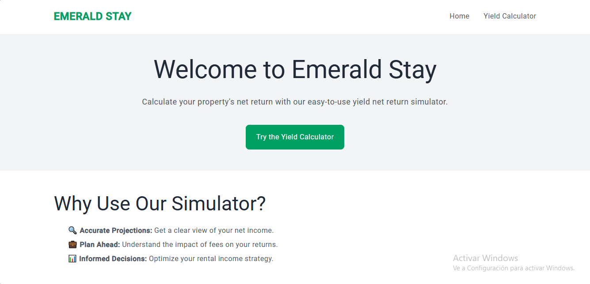
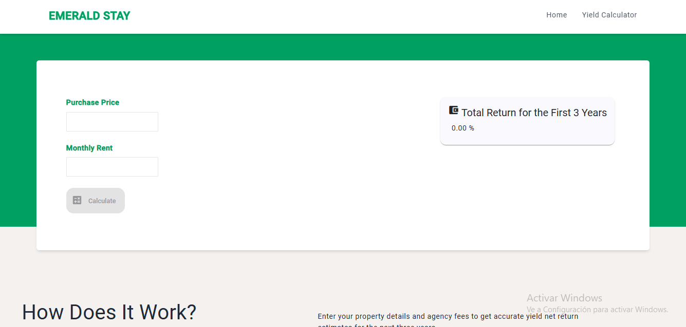
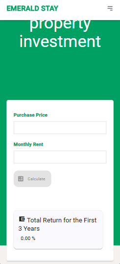

### README for **Emerald Stay Yield Net Return Simulator**

---

## Project Overview

The **Emerald Stay Yield Net Return Simulator** is a web-based tool designed to help property investors estimate their expected **net income** and **return on investment** over the first three years of ownership. It allows users to input key data such as **purchase price**, **monthly rent**, and **agency fees** to provide accurate financial projections.

The application is built using **Angular** (standalone components), **Tailwind CSS** for styling, and **Angular Material** for UI components like buttons and cards.

---

## Features

- **Interactive Yield Calculator**: Users can input the property purchase price, monthly rent, and see results immediately for the next three years, considering agency fees.
- **Annual Profitability and Net Income Calculation**: The simulator computes monthly net income and annual profitability for each year, providing a clear picture of the investment returns.
- **Responsive Design**: The entire application is responsive and user-friendly, designed to work seamlessly across devices, using **Tailwind CSS**.
- **Modular and Scalable Architecture**: The project follows best practices for Angular applications with a **clean separation of concerns** using standalone components and shared services.
- **Standalone Components**: Every component in this application is standalone, reducing the complexity and making it modular and reusable.

---

## Table of Contents

1. [Installation](#installation)
2. [Project Structure](#project-structure)
3. [Usage](#usage)
4. [Technologies Used](#technologies-used)
5. [Features Breakdown](#features-breakdown)
6. [Future Improvements](#future-improvements)

---

## Installation

To run this project locally, follow these steps:

1. **Clone the Repository**:

```bash
git clone https://github.com/your-username/emerald-stay-yield-calculator.git
cd emerald-stay-yield-calculator
```

2. **Install Dependencies**:

```bash
npm install
```

3. **Run the Application**:

```bash
ng serve
```

Open your browser and navigate to `http://localhost:4200` to see the app in action.

---

## Project Structure

The project follows a well-structured organization with standalone components and a clear separation of concerns:

```bash
src/
│
├── app/
│   ├── core/                   # Core module for services and data access
│   │   └── data-access/
│   │       ├── services/       # YieldCalculatorService
│   │       └── mocks/          # Mock data for agency fees
│   ├── shared/                 # Shared models and utilities
│   │   └── models/             # YieldReturn model
│   ├── home/                   # Home component files (standalone)
│   │   ├── home.component.ts
│   │   ├── home.component.html
│   │   ├── home.component.css
│   ├── yield-calculator/       # Yield Calculator feature
│   │   ├── features/
│   │   │   ├── yield-calculator.component.ts
│   │   │   ├── yield-calculator.component.html
│   │   │   └── yield-calculator.component.css
│   │   ├── ui/                 # UI elements like Yield Result Card
│   │       ├── yield-result-card/
│   │           ├── yield-result-card.component.ts
│   │           ├── yield-result-card.component.html
│   │           └── yield-result-card.component.css
│   ├── app.component.ts        # Main application component
│   └── app.routes.ts           # Route configuration for lazy loading
```

### Routing

The application uses lazy loading for the main features:

```typescript
export const routes: Routes = [
  {
    path: '',
    loadComponent: () => import('./home/home.component').then(m => m.HomeComponent)
  },
  {
    path: 'yield',
    loadComponent: () => import('./yield-calculator/features/yield-calculator.component').then(m => m.YieldCalculatorComponent)
  }
];
```

### Core Services

- **YieldCalculatorService**: Responsible for calculating the net income and return on investment based on input values. It uses mock data for agency fees and returns detailed results including:
  - **Total Return** for the first three years.
  - **Net Income per Month** and **Annual Profitability** for each year.

---

## Usage

### Home Page

The **Home Page** welcomes the user and provides a quick overview of the tool. It includes a call-to-action button that directs users to the **Yield Calculator**:

```html
<a routerLink="/yield" class="link mt-6 inline-block bg-[#00a062] hover:bg-[#008060] px-6 py-3 rounded-lg transition-colors duration-300">
  Try the Yield Calculator
</a>
```

### Yield Calculator

The **Yield Calculator** page allows users to input the **Purchase Price** and **Monthly Rent**. The form is validated and users can calculate their return on investment, with results displayed in a responsive layout using **Angular Material** components:

```html
<form (ngSubmit)="calculate()" #form="ngForm">
  <!-- Input fields for purchase price and monthly rent -->
  <button mat-fab extended type="submit" [disabled]="form.invalid">Calculate</button>
</form>
<app-yield-result-card [results]="results"></app-yield-result-card>
```

### Yield Result Card

The **Yield Result Card** dynamically displays the results calculated by the service, showing the total return and breakdown for each year.

---

## Technologies Used

- **Angular 18**: Standalone components architecture for modularity and lazy loading.
- **Tailwind CSS**: Responsive design and custom styles for the UI.
- **Angular Material**: UI components like buttons and cards.
- **TypeScript**: Strongly typed language for safer and more maintainable code.
- **FormsModule**: Angular module for handling reactive forms and validation.

---

## Features Breakdown

- **Standalone Components**: The entire application is built using standalone components, following practices for modularity and reusability.
- **Service-Driven Architecture**: Core business logic, such as yield calculations, is encapsulated in services, allowing easy maintenance and scalability.
- **Tailwind CSS**: Provides a modern, responsive UI with minimal custom CSS.
- **Angular Material**: Enhances the user experience with polished UI elements.
- **Responsive and Clean UI**: The app uses Tailwind for a fully responsive layout, ensuring a seamless experience across devices.

---

## Future Improvements

- **Backend Integration**: The simulator could be extended with real-time data integration to pull property prices and rent values.
- **Advanced Analytics**: Add more detailed analytics and visualizations (graphs, charts) for the net return.
- **User Authentication**: Add user accounts for tracking past yield simulations.
- **Customization Options**: Allow users to customize the simulation with additional parameters like taxes, maintenance costs, etc.


## Screenshots 
### Desktop vs Mobile Views

| Desktop Home Page | Mobile Home Page |
|-------------------|------------------|
|  |  |

| Desktop Yield Calculator | Mobile Yield Calculator |
|--------------------------|-------------------------|
|  |  |
